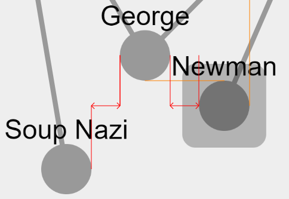
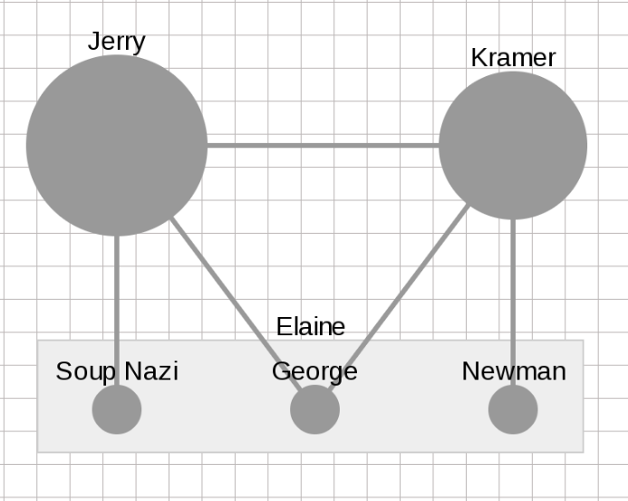

cytoscape-grid-guide
================================================================================

## Description

| Guideline example | Grid example |
| ------------- | ------------- |
| | |

A sophisticated and highly customizable Cytoscape.js extension for grid and guideline interactions, distributed under [The MIT License](https://opensource.org/licenses/MIT). The following features are provided:

- **Grid**: Shows a grid in the canvas (with specified size).
- **Auto resizing nodes**: Nodes are resized to fit perfectly to grid.
- **Alignment guidelines on drag**: As a node is dragged different types of guidelines are drawn to indicate both horizontal and vertical alignment of the dragged node with others. Two nodes are considered aligned when the difference between their x or y coordinates are within the specified tolerance:
    - _**Reference guidelines**_: When the dragged node aligns horizontally or vertically with the position of the mouse when the node is picked for drag, this guideline is drawn.
    - _**Geometric guidelines**_: When the dragged node (center or edge) aligns horizontally or vertically with another node (center or edge) within specified range, this guideline is drawn.
    - _**Distribution guidelines**_: This type of guideline is drawn in one of these two different cases:
       - when the center of the dragged node is in the middle of the closer edges of two other nodes horizontally or vertically (i.e. dragged node is in the middle of two other nodes)
       - when the distance between the dragged node A to node C is exactly twice the distance to node B horizontally or vertically (i.e. node B is in the middle of the dragged node A and another node C)
- **Snapping nodes**: Nodes are snapped either to the grid or alignment location. The following options are available:
    - _**Snap to grid on mouse release**_: Upon release of the mouse during drag, the node snaps to theclosest grid location.
    - _**Snap to grid during drag**_: During drag the node snaps to the closest grid location; dragging is discrete.
    - _**Snap to alignment location on mouse release**_: Note that guidelines are drawn when the node is within a certain 'tolerance' amount to perfect alignment. Upon release of the mouse during drag, the node snaps to shown guideline to form perfect alignment.
    - _**Snap to alignment location during drag**_: Note that guidelines are drawn when the node is within a certain 'tolerance' amount to perfect alignment. During drag, the node snaps to shown guideline to form perfect alignment.

The users are allowed to customize various things about the functionality including:
- grid size and color
- snap type
- alignment guideline tolerance
- colors and line styles of each type of guidelines
- range of geometric and distribution guidelines (i.e. do not consider nodes that are outside this range for alignment)
- whether or not edge to center alignment should be ignored

## Demo

Click [here](https://rawgit.com/iVis-at-Bilkent/cytoscape.js-grid-guide/master/demo.html) for demo

## API

 * `cy.gridGuide(options)` Sets stated options any time wanted.
 
 * `eles.align(horizontal, vertical, alignTo)` Aligns vertically/horizontally dimensions of eles to first element of eles
 ( or if alignTo is specified aligns to it). `horizontal` param may get `top`, `center`, `bottom` and `vertical` param may get `left`, `center`, `right` and `horizontal`.
 
 For example the code below aligns selected nodes to top left of first selected node.
```js
cy.nodes(":selected").align("top", "left")
```
 
# Default Undo/Redo Actions
```js
ur.do("align", {
    nodes: cy.nodes(":selected"),
    vertical: "left",
    horizontal: "top",
    alignTo: cy.nodes(":selected")[0],
})
```
 
 
## Default Options
```js
var options = {
    // On/Off Modules
    /* From the following four snap options, at most one should be true at a given time */
    snapToGridOnRelease: true, // Snap to grid on release
    snapToGridDuringDrag: false, // Snap to grid during drag
    snapToAlignmentLocationOnRelease: false, // Snap to alignment location on release
    snapToAlignmentLocationDuringDrag: false, // Snap to alignment location during drag
    distributionGuidelines: false, // Distribution guidelines
    geometricGuideline: false, // Geometric guidelines
    initPosAlignment: false, // Guideline to initial mouse position
    centerToEdgeAlignment: false, // Center to edge alignment
    resize: false, // Adjust node sizes to cell sizes
    parentPadding: false, // Adjust parent sizes to cell sizes by padding
    drawGrid: true, // Draw grid background

    // General
    gridSpacing: 20, // Distance between the lines of the grid.

    // Draw Grid
    zoomDash: true, // Determines whether the size of the dashes should change when the drawing is zoomed in and out if grid is drawn.
    panGrid: false, // Determines whether the grid should move then the user moves the graph if grid is drawn.
    gridStackOrder: -1, // Namely z-index
    gridColor: '#dedede', // Color of grid lines
    lineWidth: 1.0, // Width of grid lines

    // Guidelines
    guidelinesStackOrder: 4, // z-index of guidelines
    guidelinesTolerance: 2.00, // Tolerance distance for rendered positions of nodes' interaction.
    guidelinesStyle: { // Set ctx properties of line. Properties are here:
        strokeStyle: "#8b7d6b", // color of geometric guidelines
        geometricGuidelineRange: 400, // range of geometric guidelines
        range: 100, // max range of distribution guidelines
        minDistRange: 10, // min range for distribution guidelines
        distGuidelineOffset: 10, // shift amount of distribution guidelines
        horizontalDistColor: "#ff0000", // color of horizontal distribution alignment
        verticalDistColor: "#00ff00", // color of vertical distribution alignment
        initPosAlignmentColor: "#0000ff", // color of alignment to initial mouse location
        lineDash: [0, 0], // line style of geometric guidelines
        horizontalDistLine: [0, 0], // line style of horizontal distribution guidelines
        verticalDistLine: [0, 0], // line style of vertical distribution guidelines
        initPosAlignmentLine: [0, 0], // line style of alignment to initial mouse position
    },

    // Parent Padding
    parentSpacing: -1 // -1 to set paddings of parents to gridSpacing
};
```

## Dependencies

 * Cytoscape.js >=1.6.10
 * jQuery ^1.4 || ^2.0 || ^3.0


## Usage instructions

Download the library:
 * via npm: `npm install cytoscape-grid-guide`,
 * via bower: `bower install cytoscape-grid-guide`, or
 * via direct download in the repository (probably from a tag).

`require()` the library as appropriate for your project:

CommonJS:
```js
var cytoscape = require('cytoscape');
var jquery = require('jquery');
var gridGuide = require('cytoscape-grid-guide');

gridGuide( cytoscape, jquery ); // register extension
```

AMD:
```js
require(['cytoscape', 'jquery', 'cytoscape-grid-guide'], function( cytoscape, jquery, gridGuide ){
    gridGuide( cytoscape, jquery ); // register extension
});
```

Plain HTML/JS has the extension registered for you automatically, because no `require()` is needed.


## Publishing instructions

This project is set up to automatically be published to npm and bower.  To publish:

1. Set the version number environment variable: `export VERSION=1.2.3`
1. Publish: `gulp publish`
1. If publishing to bower for the first time, you'll need to run `bower register cytoscape-grid-guide https://github.com/iVis-at-Bilkent/cytoscape.js-grid-guide.git`

## Team

  * [Ilkin Safarli](https://github.com/kinimesi), [Selim Firat Yilmaz](https://github.com/mrsfy), [Ugur Dogrusoz](https://github.com/ugurdogrusoz) of [i-Vis at Bilkent University](http://www.cs.bilkent.edu.tr/~ivis)
